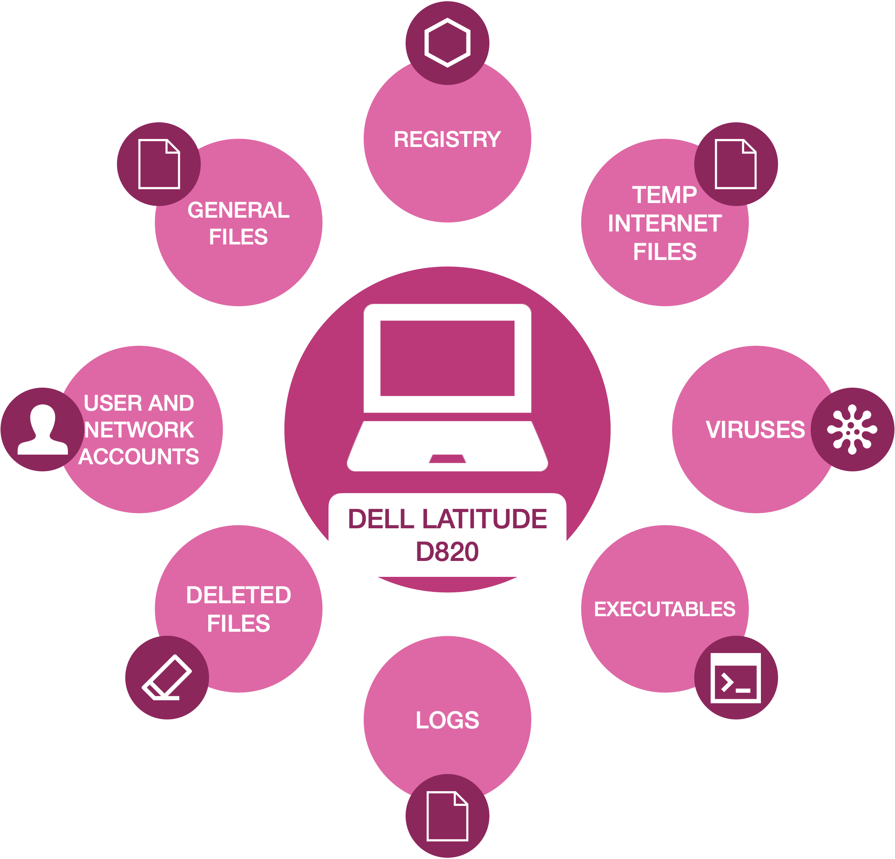
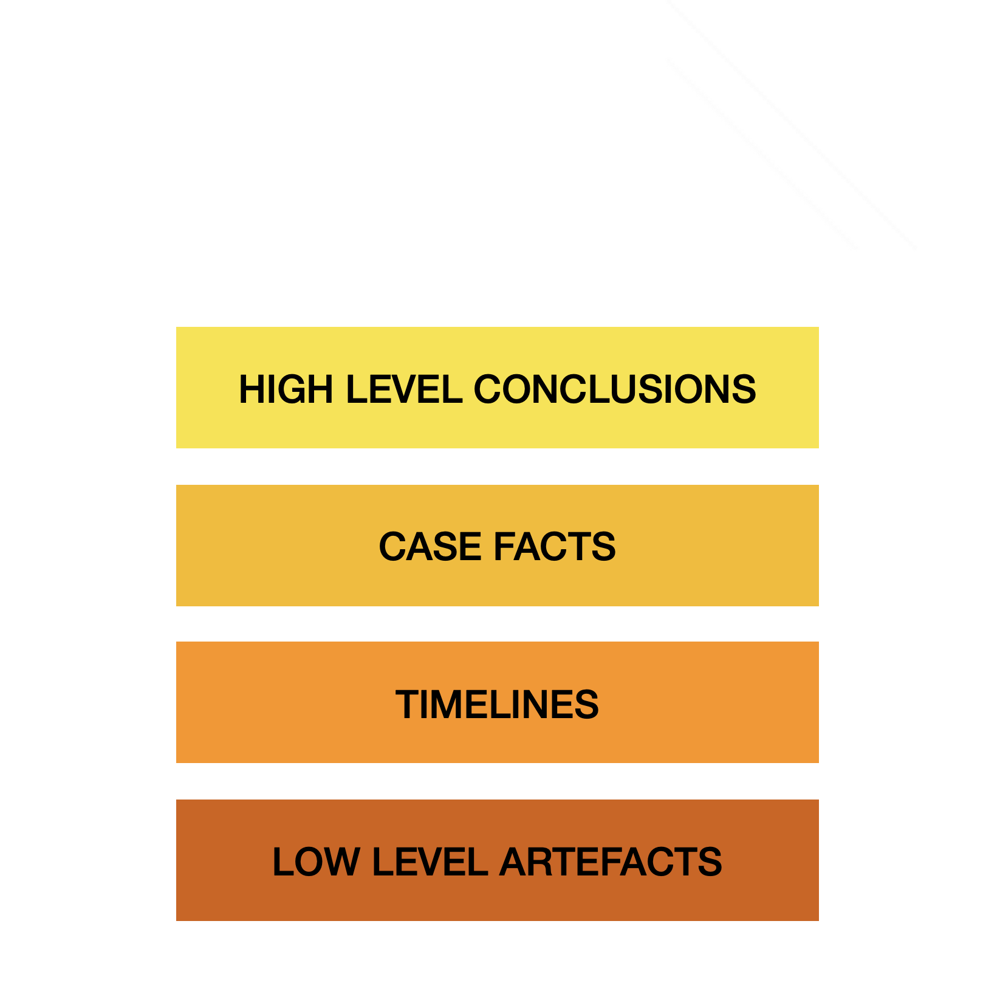

# Devising the Cognitive Steps for Information Processing in Digital Investigations

## Overview
Michel Fiola's employment was terminated and the individual faced criminal charges when illicit activity and material was identified and located on his workplace system.

## Materials
* [Michael Fiola case PDF](../resources/case.pdf).
* [Michael Fiola case video](../resources/fiola.m4v).
* 250-word summary (produced by learner in advance).
* Sticky notes or index cards.

## Task 0: Preparation
Students should self-organise into pairs, that represent a digital investigation start-up. Pairs should name their start-up and advise the lecturer.

## Task 1: Key cognitive steps for the model.

Figure 1 illustrates an initial wireframe of the key steps for the cognitive model. Firms should begin with **External Data Sources**, such as the hard disk, and then conclude with a **Presentation** to the client that has employed their services.

||
|:--:|
|Figure 1: Key Cognitive Steps for processing information in digital investigations. |

Pairs should devise at least **FOUR** key cognitive steps that investigators need to make to progress from External Data Sources to final Presentation.

1. **Actions [5 minutes].** Pairs should consider all the possible actions and steps that investigators may take in progressing from *external data sources* illustrated in Figure 2, to the *final presentation* illustrated in an examiner's report in Figure 3.

For each action or step, pairs should note it down on the sticky notes or index cards provided. Firms should note down as many as possible.

||
|:--:|
|Figure 2: Potential data sources from Fiola's Dell laptop in the case |

||
|:--:|
|Figure 3: Elements of an examiner's report |

2. **Consolidate [5 minutes].** Pairs should consolidate and start to group actions and elements together to form more concrete and abstract steps. For example, many actions could form together into identifying specific evidence or organising evidence into some specific narrative.

3. **Refine [5 minutes].** Pairs should continue to refine the steps until they have no more than **SIX** cognitive steps, including the initial step of **External Data Sources** and the closing step of **Presentation**.

4. **Document [5 minutes].** Pairs should produce a **FIVE** minute presentation, one minute articulating and providing justification for each of the steps and an additional minute for introductions.
