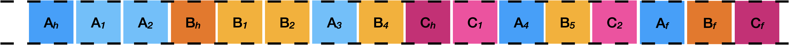

# Multiple Interleaved File Fragmentation

## Overview
Learners will form start-up firms are will produce a mock file system comprising of multiple interleaved files for another start-up firm to carve file fragments and complete files from the container.

Start-up firms in the design of their mock file system should (1) aim to challenge or *stump* the other start-up firm but (2) represent a realistic scenario of multiple interleaved files.

||
|:--:|
|Figure 1: Multiple contiguous interleaved files|

### Materials
* [File A](fileA.html)
* [File B](fileB.html)
* [File C](fileC.html)
* [File D](fileD.html)
* [File E](fileE.html)
* [File F](fileF.html)
* [File Signatures](fileSignatures.html)

### Task 0: Task preparation

1. Learners should form start-up firms of no more than **FOUR** members. Start-up firms should identify a firm they are going to partner with on the task.

2. Firms should gather together the materials they require for the exercise and introduce themselves to each other.

### Task 1: Preparing the file system.

1. Groups should select between **THREE** and **FOUR** files from the file set. Groups should use the scissors and follow the cutting guidelines to segment the files into `file blocks`.

2. Groups should then identify the **FIRST** file block for each file, consult the *File Signature* reference sheet, flip over the file block and write the appropriate `HEX` label on the back. Similarly, groups should then identify the **LAST** file block for each file, flip them over and write the appropriate file trailer, if appropriate.

3. Groups should then take all the remaining file blocks for each file, ensure they are in sequence and flip them over and write their corresponding number on the back, for example: the second file block for each file should be labelled `2`, the third `3` and so and so forth until the penultimate file block for each file.

4. Groups should then arrange each of the file blocks on the *File System Container* similar to the layout to that as illustrated in **Figure 1**. Groups should place them in the correct sequence and then flip each over so that the file content is visible. Groups should recall that the aim of activity is to produce a (1) realistic file block allocation for the files as well as (2) challenge or stump the group's adversary.

### Task 2: Devising file content carving algorithm for multiple interleaved files.
Start-up firms should now consider how they will recover as many file fragments or complete files from file systems that exhibit interleaved content with multiple files. Firms should consider the following challenges:

* **Fragmentation rates for file types.** Fragmentation varies for file types with the file types that investigators interested in, likely to exhibit higher fragmentation rates. How did firms recognise this when they generated mock disk images? How do the carving algorithms devised by teams accommodate different fragmentation rates?

* **Adjacent file blocks.** A challenge in recovering files is that the file blocks are not in the appropriate sequence. How do the carving algorithms devised by teams decide how to determine the optimal sequence of file blocks?

* **Scale.** The examples considered are small in scale and it is likely that any devised approached will collapse with considering millions of file blocks. How do the carving algorithms devised by teams reflect the challenge that scale presents?

Firms have **30 minutes** to devise their algorithm to recover files. Firms should produce a **THREE** slide presentation that outlines:

* **Assumptions [1 minute].** Outline any assumptions about the disk images they have made in the design and execution of their algorithm.

* **File Carving Algorithm [1 minute].** The specific steps of the algorithm, sufficient detail to support other teams in executing the process.

* **Limitations or concerns [1 minute].** The limitations of the proposed approach or specific concerns that may undermine the extracted artefact.

The presentation should not exceed **FOUR** minutes with members expected to spend no more than 1 minute on each slide.

### Task 3: Executing file content carving algorithm for multiple interleaved files.

1. Firms should now exchange their file container layout. Firms can provide any assumptions or constraints that they believe the other group should be made aware.

2. Firms have **15 minutes** to recover as many file fragments or complete files as possible from the file system they received from the other firm using the algorithm they devised in the prior task. Firms should document any problems or issues they encounter as they execute their algorithm.

3. Firms now have additional **15 minutes** to make refinements to their algorithm to attempt to improve recovery of file fragments or complete files. Firms should document the refinements they make to their algorithm.

4. Firms should produce **ONE** additional slide for the presentation they produced in Task 2. The slide should detail the outcome of executing their algorithm and any subsequent refinements they made in response. The slide should take no more than 1 minute to present.
